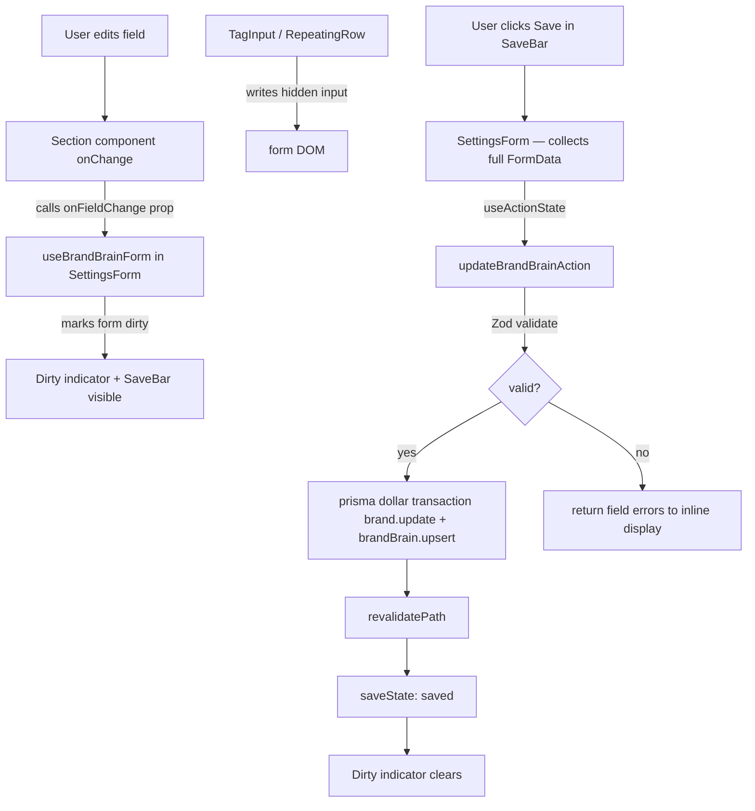
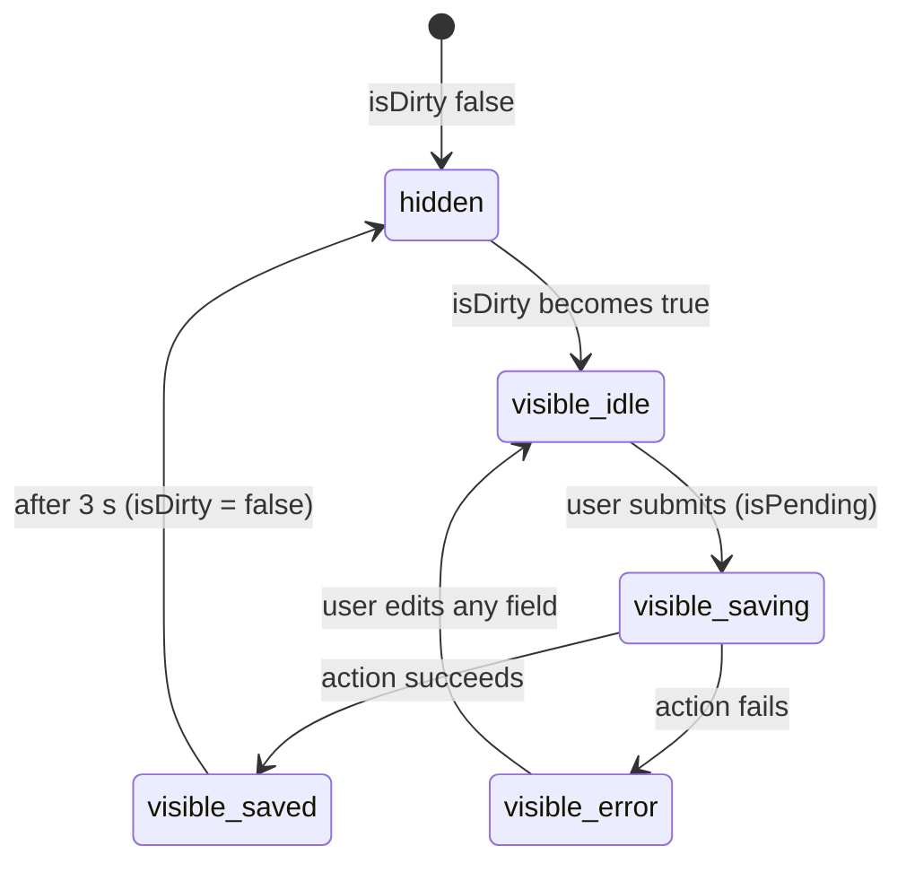
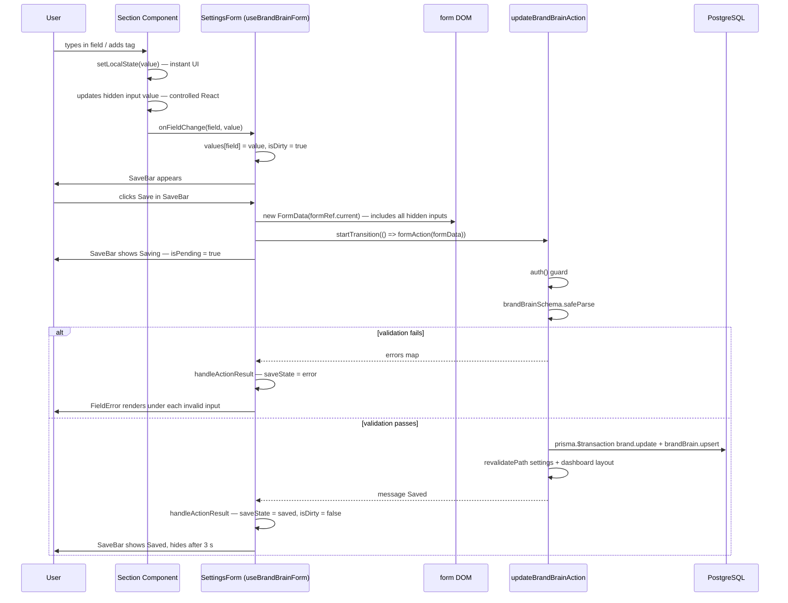

# Design Document: Brand Brain Settings Refactor

## Overview

The Brand Brain settings page has a dual-save architecture that produces data loss, silent failures, optimistic UI lies, and multiple project-rule violations. The current design uses `fetch()`-based section auto-saves that race against a top-level Server Action, a `window.dispatchEvent` coupling channel between section components and the parent form, and tag/repeating-row fields that never write back into `<form>` state — all of which must be eliminated.

This refactor collapses the dual-save architecture into a single unified save path using one Server Action (`updateBrandBrainAction`), removes `useSectionAutoSave` entirely, eliminates `window.dispatchEvent`, adds a `useBrandBrainForm` hook for dirty-state tracking, introduces a sticky `SaveBar` and a `beforeunload` guard, wires inline validation errors, and fixes the five concrete data bugs (`foundedYear: "null"`, accent colour disconnect, brand name not updating `Brand.name`, tag fields lost on top-level save, and optimistic saved state). No new Prisma schema fields are required — all M2 fields already exist.

---

## Bug Details

### B1 — Dual-save data loss (sections overwrite each other)

Section auto-saves fire `fetch()` to `/api/brand-brain/[sectionId]` with only that section's fields. Because `updateData` uses an `|| null` fallback for absent keys in the API route, unrelated fields in the same `BrandBrain` row are set to null each time any section saves. Concurrent saves from different sections race and clobber each other.

### B2 — Tag and repeating-row fields missing from top-level FormData

`TagInput` (coreValues, voiceAdjectives, primaryKeywords, secondaryKeywords) and `RepeatingRow` (productList, competitorList, faqList) manage their state in local React state and never write a named `<input>` into the `<form>` DOM. When `updateBrandBrainAction` reads `formData.get("coreValues")` it gets `null`, which serialises to `""` and overwrites the previously saved JSON array.

### B3 — Accent colour controlled input disconnect

`AppearanceSection` calls `document.getElementById("accentColour").value = color` expecting to update the form's `<input name="accentColour">`. That element is a separate React-controlled component in `SettingsForm`; the imperative DOM mutation on the unrelated element in `AppearanceSection` has no effect on what the form submits. The form always submits `accentColour = ""`.

### B4 — Brand name only updates BrandBrain, not Brand.name

The section auto-save calls `/api/brand-brain/brand-identity` which runs `prisma.brandBrain.upsert` only. The top-level `updateBrandBrainAction` does update `Brand.name` but uses a nested write (not a transaction). A failure in the upsert can leave `Brand.name` updated while brain data is stale, or vice versa.

### B5 — foundedYear renders as the string "null"

`String(null)` produces `"null"`. When no `BrandBrain` row exists yet (`brain` is null), `brain?.foundedYear ?? ""` short-circuits to `""` correctly — but any code path that calls `String(brain.foundedYear)` without a null check produces the literal string `"null"` which is passed as `defaultValue` to the `<input type="number">`.

### B6 — Optimistic "saved" shown before server confirms

`useSectionAutoSave` sets `saveState = "saved"` after 200 ms via `OPTIMISTIC_SAVED_MS` timer, before the `fetch()` even returns. The user sees "Saved" while the request is still in-flight or has already failed.

### B7 — Stale "saved" message never clears

`SettingsForm` renders `{state?.message && !state.errors && <div>✓ Saved</div>}` from `useActionState`. This never resets between saves — the green "✓ Saved" persists after the user makes new changes.

### B8 — No unsaved-changes indicator

Users can navigate away and silently lose all edits. No dirty-state indicator, no sticky save bar, no `beforeunload` guard exists.

### B9 — Inline validation errors silently swallowed

`updateBrandBrainAction` returns `{ errors: parsed.error.flatten().fieldErrors }` on Zod failure. No code in `settings-form.tsx` renders those errors — they are consumed by `useActionState` but never displayed.

### B10 — fetch() calls violate project rules

`useSectionAutoSave` calls `fetch("/api/brand-brain/${sectionId}", { method: "POST", body: formData })`. The project rules explicitly forbid raw `fetch()` to internal Next.js API routes; Server Actions must be used instead.

### B11 — window.dispatchEvent coupling violates project rules

`useSectionAutoSave` dispatches `brain-field-change` custom events, and `settings-form.tsx` listens for them via `window.addEventListener`. This is a `window` / global event anti-pattern that the project rules forbid.

### B12 — TypeScript `any` casts in parse functions

`parseCompetitors`, `parseProducts`, and `parseFaqs` use `(c: any)` and `(p: any)` cast in `arr.map()`. Strict mode is on; `any` is forbidden.

---

## Hypothesized Root Cause

The root cause is the dual-save architecture introduced without understanding how React `<form>` + `FormData` collection works. The decision to auto-save each section independently via `fetch()` was made to give instant per-section feedback, but it broke the contract between the `<form>` DOM and the Server Action because:

1. React controlled state (tag arrays, row arrays) lives outside the `<form>` DOM unless explicitly mirrored with hidden inputs.
2. The section API route only receives the fields it sends — it has no way to know "don't touch other fields", so partial writes became destructive.
3. The `window.dispatchEvent` channel was added as a band-aid to propagate section state back to the progress bar, further entrenching the anti-pattern.
4. The optimistic save timer was added to mask the latency of the `fetch()` but created a false success signal.

The fix is to remove the second write path entirely and make the `<form>` DOM the single source of truth.

---

## Expected Behavior

After the refactor:

- All saves go through `updateBrandBrainAction`. No `fetch()` to internal routes.
- Every field — including tag arrays and repeating rows — is present in `FormData` on every save via controlled hidden inputs.
- `Brand.name` and `BrandBrain` are updated atomically in a single `$transaction`.
- `foundedYear` never renders as `"null"`.
- `accentColour` is always correctly included in the save FormData.
- `saveState` transitions: idle → saving → saved (only after server confirms) → idle after 3 s.
- A `SaveBar` appears whenever the form is dirty and disappears only after a successful save.
- A `beforeunload` guard warns users attempting to navigate away with unsaved changes.
- Zod validation errors are rendered inline below the corresponding fields.
- No `window.dispatchEvent`, no `localStorage`, no `useEffect` data-fetch patterns.
- No `any` types in parse functions.

---

## Architecture

### Current (Broken) Data Flow

```mermaid
graph TD
    U[User edits field] --> SC[Section component]
    SC -->|useSectionAutoSave| FH[fetch() to /api/brand-brain/sectionId]
    SC -->|window.dispatchEvent brain-field-change| SF[SettingsForm liveValues state]
    FH --> DB[(Database — partial fields only)]
    SF --> PB[Progress bar]
    U2[User clicks Save] --> SF2[SettingsForm handleSubmit]
    SF2 -->|FormData — missing tag+row fields| SA[updateBrandBrainAction]
    SA --> DB2[(Database — overwrites tag/row fields with empty string)]
```

Problems: two writers racing to the same row, section saves only include partial fields, tag/row fields missing from FormData, `window.dispatchEvent` coupling, optimistic "saved" before server confirms.

### Target (Fixed) Data Flow



### Key Architectural Decisions

1. **Single save path.** `useSectionAutoSave` and `/api/brand-brain/[sectionId]` are retired from the form. All saves go through `updateBrandBrainAction`.

2. **No per-section saves on blur.** Section components are "dumb" renderers — they fire `onFieldChange(field, value)` and let the parent decide when to persist. This eliminates the race.

3. **Hidden inputs for tag/row fields.** `TagInput` and `RepeatingRow` wrappers render a controlled `<input type="hidden">` so every field lands in `FormData` on every submit, with no side-channel needed.

4. **`useBrandBrainForm` as the single source of truth** for live field values and dirty state. No `window.dispatchEvent`, no `useEffect` prop-sync in sections, no `localStorage`.

5. **`useActionState` save state machine.** Transitions idle → saving → saved only after the action returns successfully → idle after 3 s. Never shows "saved" optimistically.

6. **`SaveBar` mounted inside the form**, visible only when dirty. Replaces the static bottom button.

---

## Fix Implementation

### F1 — Eliminate dual-save: delete `useSectionAutoSave`, remove all section `onBlur` save calls

Delete `use-section-auto-save.ts`. Remove `useSectionAutoSave` import and call from all 10 section files. Remove all `onBlur` handlers that construct a `FormData` and call `save()`. The fields remain in the form — just no longer independently saved.

### F2 — Hidden inputs for tag/row fields

Each section containing `TagInput` or `RepeatingRow` adds a companion controlled hidden input:

```typescript
// MissionValuesSection
const [localValues, setLocalValues] = useState<string[]>(() =>
  safeJsonParse<string[]>(coreValues, [])
);

const handleChange = (tags: string[]) => {
  setLocalValues(tags);
  onFieldChange("coreValues", JSON.stringify(tags));
};

// In JSX:
<TagInput tags={localValues} onChange={handleChange} maxTags={5} ... />
<input type="hidden" name="coreValues" value={JSON.stringify(localValues)} />
```

Applied to: `coreValues`, `voiceAdjectives`, `primaryKeywords`, `secondaryKeywords`, `productList`, `competitorList`, `faqList`.

### F3 — Fix AppearanceSection accent colour

Replace the imperative DOM mutation with a controlled hidden input:

```typescript
// Before:
const input = document.getElementById("accentColour") as HTMLInputElement | null;
if (input) input.value = color;

// After (in AppearanceSection JSX, inside the form):
<input type="hidden" name="accentColour" value={selected} />
// The colour picker and swatches continue calling setSelected(color) — React then
// updates the hidden input's value prop automatically on next render.
```

The separate `<input name="accentColour">` in `SettingsForm` that was never controlled is removed.

### F4 — Fix brand name updating Brand.name

In `updateBrandBrainAction`, replace the nested `prisma.brand.update` + nested `brandBrain.upsert` with an explicit `$transaction`:

```typescript
const brandName = formData.get("brandName") as string | null;
const accentColour = (formData.get("accentColour") as string | null)?.trim() || null;
const logo = formData.get("logo") as string | null;

await prisma.$transaction([
  prisma.brand.update({
    where: { id: brand.id },
    data: {
      name: brandName ? brandName : undefined,
      logo: logo ?? undefined,
      accentColour,
    },
  }),
  prisma.brandBrain.upsert({
    where: { brandId: brand.id },
    update: brainUpdateData,
    create: { brandId: brand.id, ...brainUpdateData },
  }),
]);
```

Both writes succeed or both roll back.

### F5 — Fix foundedYear "null" string

In `page.tsx`, ensure `foundedYear` is always serialised with a null guard:

```typescript
foundedYear: brain.foundedYear != null ? String(brain.foundedYear) : "",
```

In `updateBrandBrainAction`, guard against the string `"null"` being submitted:

```typescript
const yearStr = formData.get("foundedYear") as string | null;
const foundedYear =
  yearStr && yearStr !== "" && yearStr !== "null"
    ? (parseInt(yearStr, 10) || null)
    : null;
```

### F6 — Fix save state machine: remove optimistic timer

Delete `useSectionAutoSave` (covers this). In `useBrandBrainForm`, `saveState` only transitions to `"saved"` inside `handleActionResult` after the action promise resolves:

```typescript
function handleActionResult(result: SettingsActionState): void {
  if (result.errors) {
    setSaveState("error");
    setFieldErrors(result.errors);
    return;
  }
  if (result.message) {
    setSaveState("saved");
    setIsDirty(false);
    setFieldErrors({});
    clearTimeout(fadeTimer.current);
    fadeTimer.current = setTimeout(() => setSaveState("idle"), 3_000);
  }
}
```

### F7 — Clear stale "saved" message

`SettingsForm` no longer renders `state?.message && !state.errors` directly. The save feedback is owned entirely by `SaveBar` which reads `saveState` from `useBrandBrainForm`. `SaveBar` auto-hides when `saveState` returns to `"idle"`. There is no persistent message element outside of `SaveBar`.

### F8 — Add SaveBar and unsaved-changes indicator

New `SaveBar` component renders sticky at the bottom of the viewport when `isDirty`. It shows the current `saveState`:

```typescript
// Pseudo-render logic:
if (!isDirty && saveState === "idle") return null;
```

New `useBeforeUnload` hook attaches the browser `beforeunload` event:

```typescript
export function useBeforeUnload(isDirty: boolean): void {
  useEffect(() => {
    if (!isDirty) return;
    const handler = (e: BeforeUnloadEvent) => {
      e.preventDefault();
      e.returnValue = "";
    };
    window.addEventListener("beforeunload", handler);
    return () => window.removeEventListener("beforeunload", handler);
  }, [isDirty]);
}
```

Used in `SettingsForm`: `useBeforeUnload(isDirty)`.

### F9 — Render inline validation errors

Pass `actionState.errors` from `useActionState` down to sections as the `errors` prop. Each field renders `<FieldError messages={errors?.fieldName} />` below the input. On error, a conditional border class is applied:

```typescript
className={cn(
  "mos-input h-10 w-full rounded-md px-3 text-sm ...",
  errors?.brandName && "border-[var(--color-danger)]"
)}
```

After errors display, `SettingsForm` scrolls the first errored field into view:

```typescript
useEffect(() => {
  if (actionState?.errors) {
    const firstError = document.querySelector("[data-field-error]");
    firstError?.scrollIntoView({ behavior: "smooth", block: "center" });
  }
}, [actionState?.errors]);
```

### F10 — Remove window.dispatchEvent

Delete all `window.dispatchEvent(new CustomEvent("brain-field-change", ...))` calls from `useSectionAutoSave` (deleted). Remove the `window.addEventListener("brain-field-change", ...)` in `SettingsForm`. The `liveValues` state driven by this event is replaced by the `values` map in `useBrandBrainForm`, populated via `onFieldChange` props.

### F11 — Remove TypeScript `any` casts

```typescript
// competitors-section.tsx
type RawCompetitor = { name?: string; positioningNote?: string } | string;
function parseCompetitors(raw: string): RowData[] {
  try {
    const arr = JSON.parse(raw || "[]") as RawCompetitor[];
    return arr.map((c, i) => ({
      id: `competitor-${i}-${Date.now()}`,
      name: typeof c === "string" ? c : (c.name ?? ""),
      positioningNote: typeof c === "string" ? "" : (c.positioningNote ?? ""),
    }));
  } catch { return []; }
}

// products-services-section.tsx
type RawProduct = { name?: string; oneLiner?: string } | string;

// faqs-section.tsx
type RawFaq = { question?: string; answer?: string } | string;
```

---

## Components and Interfaces

### `useBrandBrainForm` (new — `use-brand-brain-form.ts`)

```typescript
type SaveState = "idle" | "saving" | "saved" | "error";

type UseBrandBrainFormOptions = {
  initialValues: BrainFieldMap;
  initialBrandName: string;
  initialAccentColour: string | null;
};

type UseBrandBrainFormReturn = {
  values: BrainFieldMap;
  isDirty: boolean;
  saveState: SaveState;
  fieldErrors: Partial<Record<string, string[]>>;
  onFieldChange: (field: string, value: string) => void;
  handleActionResult: (result: SettingsActionState) => void;
  markSaving: () => void;
};
```

`isDirty` is computed by comparing `values` to `initialValues` on every `onFieldChange` call. The initial values snapshot is captured at hook mount and updated only when `handleActionResult` receives a success — never during an in-progress edit.

### `SaveBar` (new — `components/ui/save-bar.tsx`)

```typescript
type SaveBarProps = {
  isDirty: boolean;
  saveState: SaveState;
  isPending: boolean;
};
// SaveBar is inside the <form> — the "Save now" button is type="submit"
// No onClick handler needed; the form's onSubmit fires naturally.
```



### `FieldError` (new — `components/ui/field-error.tsx`)

```typescript
type FieldErrorProps = {
  messages?: string[];
};

export function FieldError({ messages }: FieldErrorProps): React.ReactElement | null;
```

Renders a `<ul role="alert" aria-live="polite">` containing each message as a `<li>` in `var(--color-danger)` text. Returns `null` when `messages` is undefined or empty.

### Section components — unified prop shape

After refactor, every section accepts:

```typescript
type SectionWithCallbackProps = {
  onFieldChange: (field: string, value: string) => void;
  errors?: Partial<Record<string, string[]>>;
  // + field value props specific to each section
};
```

The `slug` prop is removed from all sections (no longer needed — sections do not save independently). The `slug` remains in the parent `SettingsForm` only, and is written as a hidden input into the form.

---

## Data Flow Diagram — After Refactor



---

## File-Level Change Summary

### Modified files

| File | Change |
|---|---|
| `settings-form.tsx` | Remove `window.addEventListener`, `useEffect` brain-sync, `useEffect` router.refresh. Add `useBrandBrainForm`, pass `onFieldChange` + `errors` to all sections. Render `SaveBar`. |
| `actions.ts` | Wrap in `$transaction`, fix `foundedYear` null-guard, ensure `Brand.name` updates atomically, keep field list unchanged. |
| `page.tsx` | Tighten `foundedYear` serialisation with `!= null` guard. |
| `sections/brand-identity-section.tsx` | Remove `useSectionAutoSave`, remove `onBlur` save calls, accept `onFieldChange` + `errors` props, remove `slug` prop. |
| `sections/mission-values-section.tsx` | Remove `useSectionAutoSave`, remove `useEffect` prop-sync, add hidden input for `coreValues`, call `onFieldChange`. |
| `sections/voice-tone-section.tsx` | Same as above for `voiceAdjectives`. |
| `sections/target-audience-section.tsx` | Remove `useSectionAutoSave`, call `onFieldChange` on blur, no hidden inputs needed. |
| `sections/products-services-section.tsx` | Remove `useSectionAutoSave`, add hidden input for `productList`, fix `parseProducts` `any` cast. |
| `sections/competitors-section.tsx` | Same for `competitorList`, fix `parseCompetitors` `any` cast. |
| `sections/seo-keywords-section.tsx` | Remove `useSectionAutoSave`, remove `useEffect` prop-syncs, add hidden inputs for `primaryKeywords` and `secondaryKeywords`. |
| `sections/faqs-section.tsx` | Remove `useSectionAutoSave`, add hidden input for `faqList`, fix `parseFaqs` `any` cast. |
| `sections/additional-context-section.tsx` | Remove `useSectionAutoSave`, call `onFieldChange` on blur. |
| `sections/appearance-section.tsx` | Replace imperative DOM mutation with controlled `<input type="hidden" name="accentColour">`, call `onFieldChange`. |

### New files

| File | Purpose |
|---|---|
| `use-brand-brain-form.ts` | Dirty-state tracking, field value map, `handleActionResult`, `saveState` machine. |
| `use-before-unload.ts` | Attaches/removes `beforeunload` event listener based on `isDirty`. |
| `components/ui/save-bar.tsx` | Sticky bottom bar — visible on dirty, shows save state transitions. |
| `components/ui/field-error.tsx` | Inline validation error renderer used by all section fields. |

### Deleted files

| File | Reason |
|---|---|
| `use-section-auto-save.ts` | Entirely replaced by `useBrandBrainForm` + single Server Action save path. |

---

## Testing Strategy

### Unit tests — `useBrandBrainForm`

- `isDirty` starts `false`, becomes `true` after `onFieldChange`, returns `false` after successful `handleActionResult`.
- `saveState` transitions: idle → saving (via `markSaving`) → saved (via `handleActionResult` success) → idle after timeout.
- `saveState` transitions: saving → error (via `handleActionResult` with errors).
- `fieldErrors` is populated on error result and cleared on success result.

### Unit tests — `updateBrandBrainAction`

- Returns `{ errors }` when Zod validation fails.
- Returns `{ message }` on success.
- `foundedYear`: `"null"` input → `null` in DB; `"2020"` → `2020`; `""` → `null`.
- Both `Brand.name` and `BrandBrain` fields are updated (mock `$transaction`).

### Integration — hidden input round-trip

- `TagInput` with tags `["a","b"]` → hidden input value is `'["a","b"]'` → `FormData.get("coreValues")` returns `'["a","b"]'`.
- `RepeatingRow` with two rows → hidden input holds serialised JSON → `FormData.get("productList")` returns correct JSON.

### Regression — existing fields not overwritten

- Saving Section 1 (brand-identity) does not overwrite `competitorList` or `faqList`.
- Saving with `brandName = ""` does not update `Brand.name` to empty string (action guards with `brandName ? brandName : undefined`).

---

## Correctness Properties

### Property 1: No phantom "saved" state

`saveState === "saved"` is only reachable from `"saving"` via `handleActionResult`. There is no timer path from `"saving"` to `"saved"`. The old `OPTIMISTIC_SAVED_MS` timer is deleted; no code sets `saveState = "saved"` except `handleActionResult` after the action promise resolves with a success message.

**Validates: Requirements 2.8** (save state: idle → saving → saved only after server confirms)

### Property 2: Tag field completeness in FormData

For every tag/row field (`coreValues`, `voiceAdjectives`, `primaryKeywords`, `secondaryKeywords`, `productList`, `competitorList`, `faqList`), a controlled `<input type="hidden" name={field} value={JSON.stringify(localState)}>` is rendered inside the `<form>`. Therefore `new FormData(formRef.current).get(field)` is never `null` after the user has interacted with that section — it is at minimum `"[]"`.

**Validates: Requirements 2.2, 2.15** (full FormData on save, hidden inputs for tag/row fields)

### Property 3: Accent colour round-trip

After `handleSelect(color)` is called in `AppearanceSection`, the controlled hidden input `<input type="hidden" name="accentColour" value={selected}>` reflects `color` on the next React render. Therefore `formData.get("accentColour") === color` at submit time.

**Validates: Requirements 3.7** (accent colour persists and is reflected in sidebar on next load)

### Property 4: Atomic brand name and brain update

`updateBrandBrainAction` wraps `prisma.brand.update` and `prisma.brandBrain.upsert` in `prisma.$transaction([...])`. Either both operations succeed and are committed, or both roll back. There is no state where `Brand.name` is updated while `BrandBrain` is stale, or vice versa.

**Validates: Requirements 2.4** (brand name saves to both Brand.name and BrandBrain atomically)

### Property 5: foundedYear never serialises to the string "null"

`page.tsx` uses `brain.foundedYear != null ? String(brain.foundedYear) : ""`. The `!= null` check catches both `null` and `undefined`. The condition `brain.foundedYear != null` is `false` when the value is `null`, so `String(null)` is never called. The action also guards against the string `"null"` in the submitted FormData before calling `parseInt`.

**Validates: Requirements 2.5** (foundedYear passed as empty string, not "null", when no year stored)

### Property 6: Dirty state cleared only on confirmed save

`isDirty` is set to `false` only inside `handleActionResult` when `result.message` is truthy and `result.errors` is absent. No other code path clears `isDirty`. A failed save (`result.errors` set) leaves `isDirty = true` so the SaveBar remains visible and the user can retry.

**Validates: Requirements 2.9** (unsaved-changes indicator disappears only after successful save confirmation)

---

## Regression Prevention Notes

- `revalidatePath("/dashboard/brands/${slug}/settings")` and `revalidatePath("/dashboard", "layout")` remain in `updateBrandBrainAction` — unchanged.
- `computeBrandBrainCompleteness` and `serializeBrandForPrompt` are called only from the Server Component (`page.tsx`) — neither is touched by this refactor.
- `SECTION_DEFINITIONS` in `brand-utils.ts` is not modified.
- The `/api/brand-brain/[sectionId]` route is preserved — not called from the settings form after the refactor, but still authenticates and responds per requirement 3.11.
- All existing M2 field names in `brandBrainSchema` are unchanged.
- Legacy M1 fields remain in the `fields` array in `updateBrandBrainAction`.
- `Brand.accentColour` → CSS variable `var(--brand-accent)` wiring in the dashboard layout is not touched.
- `UploadThing` logo upload flow is unchanged.
- Per-user brand isolation (`prisma.brand.findFirst({ where: { slug, userId } })`) is unchanged.

---

## No New Prisma Schema Fields

All fields required by the 9 M2 sections already exist in `BrandBrain`. Schema additions for future sections (Marketing Strategy, Social Media, Legal & Compliance, AI Context) are out of scope for this refactor and tracked separately in requirement 2.6–2.7.

---

## Glossary

| Term | Meaning |
|---|---|
| `BrandBrain` | Prisma model holding all AI context fields for a brand |
| `BrainFieldMap` | `Record<string, string>` — all M2 string fields, passed from server to client |
| `useBrandBrainForm` | New client hook that owns dirty state, field value map, and save state machine |
| `useSectionAutoSave` | Existing hook being deleted — fetch-based, project-rule violation |
| `SaveBar` | Sticky bottom component visible when form is dirty |
| `FieldError` | Inline validation error renderer |
| `saveState` | Four-value enum: `"idle" | "saving" | "saved" | "error"` |
| Hidden input pattern | `<input type="hidden" name="field" value={localState}>` inside `<form>` — makes controlled React state visible to FormData |
| `$transaction` | `prisma.$transaction([...])` — array form, guarantees atomicity across multiple operations |
